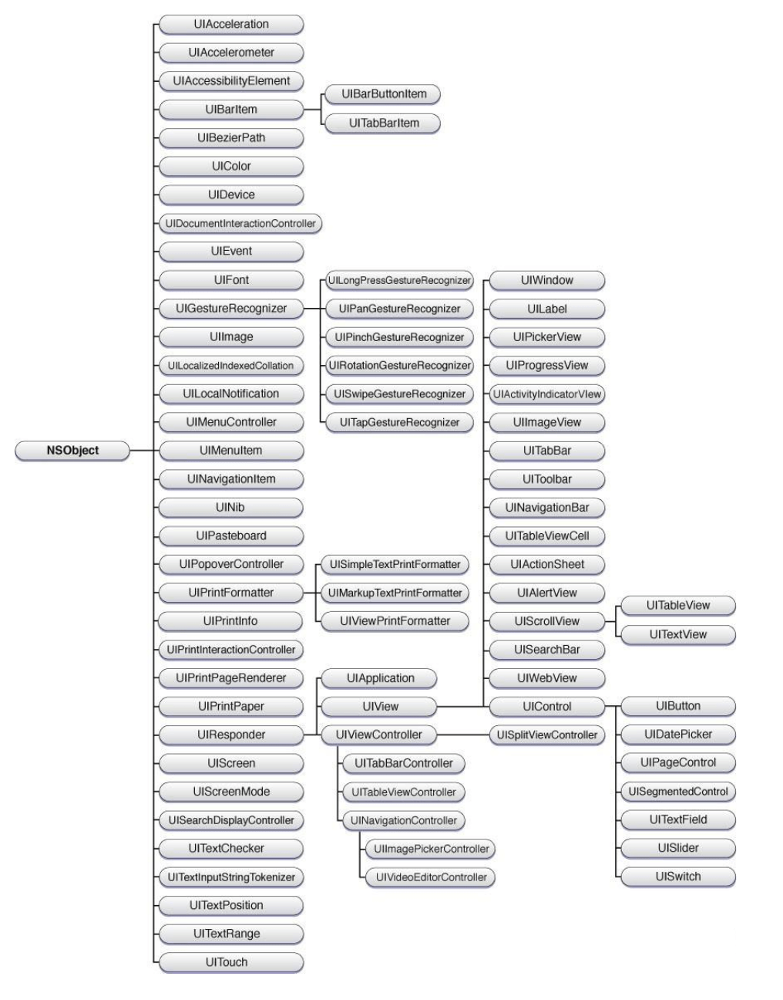

# UIKit框架简介

> UIKitk框架提供了一整套完整的API，用于建立和管理iOS应用程序的用户界面( UI )接口、应用程序对象、事件控制、绘图模型、窗口、视图和用于控制触摸屏等的接口，是一个用于控制界面操作的Class类集合，iOS开发过程中，70%~80%的工作是在围绕UIKit框架中定义的类进行的。

**UIKit中的所有类都是继承自NSObject类的，其中所有的类的命名都是以UI开头，说明这些类都是与界面操作相关的类。UIKit框架中定义了几十个子类。**



* UIResponder类定义了一个接口，响应和处理事件的对象，所有继承自UIResponder的子类都可以响应用户交互，例如，点击、滑动等等。UIResponder类的实例有时被称为作为响应者对象。
* UIView类的对象负责定义在屏幕上一块矩形区域的显示样式，以及在这块矩形区域内发生的用户交互动作。UIView类具有若干子类，这些子类除了继承了UIView类的功能外，在样式以及用途方面进行了功能扩展，例如，UILabel可以显示文字标签、UIImageView可以用来显示图片、UIButton可以用来定义按钮的样式以及行为。
* UIViewController类用于管理iOS应用程序中的数据以及视图对象，在MVC设计模式中，控制器类是模型与视图之间交互通信的桥梁和纽带。另外，像UINavigationController和UITabBarController的这样的子类，可以用于提供管理复杂的视图控制器层级结构以及视图的其他行为。
* UIGestureRecognizer是具体手势识别类的抽象基类，提供了手势类所具有的通用方法和属性。在UIKit框架中，提供了点击(UITapGestureRecognizer)、捏合(UIPinchGestureRecognizer)、旋转(UIRotationGestureRecognizer)、滑动(UISwipeGestureRecognizer)、拖动(UIPanGestureRecognizer)、长按(UILongPressGestureRecognizer)等几种手势，在开发中可以灵活使用。

# UIView

## UIView简介

> UIView是所有界面UI类控件的父类。UIView类的对象负责屏幕上一个矩形区域的显示和行为动作。我们熟知的UIButton，UIImageview等等都继承自UIView，因此，UIView所具备的属性和方法，其子类也都同样具备。

UIView类（视图类）负责管理屏幕上的一块矩形区域，包括这个区域内的显示样式，比如背景颜色，大小，以及行为动作，例如监测用户点击等触碰事件。

视图还可以用于管理一个或者多个子视图。用户看到的某个样式，有可能是多个视图叠加后的显示效果。视图的这种布局方式，也称为视图层次，一个父视图可以包含任意多个子视图。同时，父视图的属性有时也会影响到子视图的样式以及用户交互行为。

总体来讲，视图类的主要作用有如下3个方面：

* 样式显示与动画：负责自身矩形区域内样式的显示，以及某些属性（大小、位置、角度）变化时的动画过渡效果；
* 布局与子视图管理：管理子视图
* 事件处理：接收并响应用户的触摸事件

在iOS开发中，UIView与UIViewController紧密协作，UIViewController负责UIView的加载与卸载。

## UIView的父类与子类

UIView继承自UIResponder，因此UIView可以响应用户交互。另外，我们熟知的一些常用控件都继承自UIView。需要特别说明的是，窗口(UIWindow)也是继承自UIView，窗口可以认为是一个特殊的View。

## 基本样式：背景颜色、透明度以及是否隐藏

* 背景颜色属性BackgroundColor属性是UIView类中最常使用的属性之一，由于UIView是一个矩形区域，所以在实际的开发过程中，常常通过设置视图的背景颜色来检查视图的大小以及位置。
* 透明度alpha属性可以修改视图的透明度，实现一些虚化的效果。在一些游戏App中，游戏的按钮经常是虚化的效果。需要注意的是对于UIView以及其子类，当alpha的值小于等于0.01时，就不能够再响应用户交互了，例如：UIButton就不能够点击了。
* 是否隐藏hidden能够控制视图的显示与隐藏。

```objectivec
@property(nullable, nonatomic,copy)	UIColor	*backgroundColor;
@property(nonatomic)	CGFloat	alpha;
@property(nonatomic,getter=isHidden)	BOOL	 hidden;
```

## 位置与大小：Frame/Bounds/Center

```objectivec
@property(nonatomic) CGRect            frame;  
@property(nonatomic) CGRect            bounds; 
@property(nonatomic) CGPoint           center; 
```

Frame、Bounds以及Center是用来设置视图对象位置以及大小的属性，在对任何视图类对象进行初始化之后，紧接着就要去设置视图对象的Frame属性。：

* 绝对坐标系：屏幕的左上角是坐标原点（0，0），横向为X轴，纵向为Y轴；向左移动X值减小，向右移动X值增加；向下移动Y值增加，向上移动Y值减小；
* 每个视图的起始位置和大小由frame属性来确定，frame是一个CGRect类型的属性，CGRect是一个结构体，其中包含有两个变量origin和size，其中origin是一个CGPoint类型的结构体变量，指的是视图左上角的那个点的位置，决定了视图的位置；size是CGSize类型的结构体变量，定义了矩形的长度和宽度，从而决定了视图的大小；
* Frame：视图在其**父视图坐标系**中的位置和大小，建议大家在控件初始化之后，紧接着就去设置Frame，设置完成后，假如涉及到修改控件的位置、大小等，就不要再去修改Frame了；
* Bounds：视图在其**自身的坐标系**中的位置和大小。Bounds属性中，视图的bounds.origin始终是（0，0），因此bounds属性最核心的作用是设置视图的大小，即bounds.size，当需要去修改视图大小的时候，可以修改bounds.size；
* Center：视图中心点在**父视图坐标系**中的坐标，当需要修改视图对象的位置时，可以修改Center属性。

> 在开发过程中，经常需要对视图对象的样式进行修改，常见的修改操作有位移、放大/缩小、旋转等。当涉及到视图位移的时候，可以修改视图的center以及frame属性；当涉及到视图的缩放以及旋转操作时，推荐修改视图的transform属性。

## 视图的层次关系

> 在视图中可以添加子视图，通过多个视图的叠加显示，最终展示给用户。对于视图层次的管理，既可以通过InterfaceBuilder进行图形化的查看和管理，也可以通过纯代码的方式进行查看和管理，不过从实际开发经验来看，最好二选一，不要同时使用InterfaceBulider以及代码来管理子视图。

* 常用属性

```objectivec
@property(nullable, nonatomic,readonly) UIView       *superview;//父视图
@property(nonatomic,readonly,copy) NSArray *subviews;//所有的子视图
@property(nullable, nonatomic,readonly) UIWindow     *window;//视图所在的Window 
```

* 常用方法

```objectivec
- (void)addSubview:(UIView *)view;//添加子视图
- (void)bringSubviewToFront:(UIView *)view;//把某个子视图移到最前显示
- (void)sendSubviewToBack:(UIView *)view;//把某个子视图移动到最后显示
- (void)removeFromSuperview;//从父视图中移除
```

可以通过调用UIView的addSubview:以及removeFromSuperView方法，来添加/删除子视图。添加的子视图，会被插入到subviews数组的最后，最后添加的视图显示在最前端。可以通过调用bringSubViewToFront:以及sendSubViewToBack:来对子视图的显示位置进行调整。当存在较多的子视图时，UIView类也提供了相对复杂的方法，来实现层级关系的精确调整。

## 响应用户交互事件

> UIView的对象都具有响应用户交互的能力，因为UIView继承自UIResponder。在初始化视图对象的过程中，可以给UIView对象添加手势，以响应用户交互。另外，对于自定义视图类，可以通过实现其有关触摸的相关方法，来定义用户交互的动作。

### 与用户交互事件相关的属性

UIView类中，**userInteractionEnabled**属性可以用来定义视图类对象是否能够响应用户交互。对于某些UIView的子类，例如UILabel，UIImageView，该属性默认情况下是关闭的，因此如果需要响应手势等交互事件，需要修改该属性的值为YES。另外，multipleTouchEnabled属性用于设置视图对象能否支持多点触控，默认情况下，其取值是NO。

```objectivec
@property(nonatomic,getter=isUserInteractionEnabled) BOOL userInteractionEnabled; //是否支持用户交互
@property(nonatomic,getter=isMultipleTouchEnabled) BOOL multipleTouchEnabled; //是否支持多点触控
```

### 添加手势

对于视图类对象，都可以通过添加手势的方法，来响应用户的交互。一个视图类对象，可以添加多个手势。例如，在一些游戏App中，一个按钮的点击以及长按可以对应不同的操作。UIView类中，与手势相关的属性和方法如下：

```objectivec
@property(nullable, nonatomic,copy) NSArray *gestureRecognizers ;//获取视图对象上的所有手势 
- (void)addGestureRecognizer:(UIGestureRecognizer*)gestureRecognizer NS_AVAILABLE_IOS(3_2);//添加手势
- (void)removeGestureRecognizer:(UIGestureRecognizer*)gestureRecognizer NS_AVAILABLE_IOS(3_2);//移除手势
```

## 内容模式contentMode

> 视图的contentMode属性决定了边界变化和缩放操作作用到视图上产生的效果。视图在屏幕上显示后，渲染后的内容会被缓存在视图下面的层(layer)上，当视图的大小发生变化时，UIKit并不强制对视图进行重画，而是根据其contentMode属性决定如何显示缓存内容。由于这种机制的存在，当我们修改视图的大小时，可以提升性能。

contentMode经常用于图像视图UIImageview。当希望在App中调整控件的尺寸时，务必优先考虑使用contentMode，这样做可以在视图的外观发生形变时，避免编写定制的描画代码。这是因为：每个图像视图的关联图像都由Core Animation来缓存，因此不需要编写代码就可以支持动画，即不需要再次调用drawRect:方法，从而大大提高了性能。

在开发过程中，当发生如下两种情况时，会使用到contentMode：

* 改变frame或bounds中的高度或宽度；
* 修改transform属性。

UIView类中提供了**contentMode**属性，其是一个UIViewContentMode类型的变量，默认取值为 **UIViewContentModeScaleToFill** 。

```objectivec
@property(nonatomic)    UIViewContentMode contentMode; 
```

```objectivec
typedef NS_ENUM(NSInteger, UIViewContentMode) {
    UIViewContentModeScaleToFill,
    UIViewContentModeScaleAspectFit,
    UIViewContentModeScaleAspectFill, 
    UIViewContentModeRedraw,
    UIViewContentModeCenter, 
    UIViewContentModeTop,
    UIViewContentModeBottom,
    UIViewContentModeLeft,
    UIViewContentModeRight,
    UIViewContentModeTopLeft,
    UIViewContentModeTopRight,
    UIViewContentModeBottomLeft,
    UIViewContentModeBottomRight,
};
```

# 基础控件

## UITextField

> UITextField是iOS开发中用户交互的一个重要控件，常用于获取用户的文字输入，例如用户登录时使用的用户名输入框、密码输入框等。本章节我们介绍一下UITextField的基本属性和用法。

### UITextField的文本相关属性

UITextField可以用于获取用户的文字输入，因此，通过其中的text属性我们可以获取到用户输入的文字。另外，通过placeholder属性可以设置UITextField对象的占位符文字，当用户输入文字时，占位符文字会自动消失。

* 获取文本框中的文字。

```objectivec
@property(nullable, nonatomic,copy) NSString *text; 
```

* 占位符。通常在手机App的用户输入框中，都会有浅色的占位字，告诉用户“请输入用户名”或者“请输入密码”。

```objectivec
@property(nullable, nonatomic,copy) NSString  *placeholder; 
```

* 字体颜色

```objectivec
@property(nullable, nonatomic,strong) UIColor  *textColor;  
```

* 字体大小

```objectivec
@property(nullable, nonatomic,strong) UIFont *font;
```

* 文本对齐方式。文本框中的文字还可以设置对齐方式，一般常用的如居左、居中或居右。

```objectivec
@property(nonatomic) NSTextAlignment textAlignment; 
```

### UITextField的外观属性

* UITextField的背景颜色。

```objectivec
@property(nullable, nonatomic,copy) UIColor  *backgroundColor;
```

* UITextField的边框样式。borderStyle有4种常见的样式，分别为：无边框UITextBorderStyleNone、线形边框UITextBorderStyleLine、带阴影效果的边框UITextBorderStyleBezel以及圆角边框UITextBorderStyleRoundedRect

```objectivec
@property(nonatomic) UITextBorderStyle  borderStyle;   
```

### 其他属性

* 设置输入文本时弹出的键盘类型(默认键盘、数字键盘、 数字+符号键盘等等)，例如当我们希望用户输入的是电话号码时，最好弹出数字键盘，这样便于用户输入。

```objectivec
@property(nonatomic) UIKeyboardType keyboardType; 
```

* 键盘弹出后的键盘返回键类型，例如：当键盘返回键类型取值为UIReturnKeyDefault以及UIReturnKeyGo时，弹出键盘的样式对比。

```objectivec
@property(nonatomic) UIReturnKeyType returnKeyType; 
```

* 设置输入框输入的字母是否大写

```objectivec
@property(nonatomic) UITextAutocapitalizationType autocapitalizationType; 
```

* 当开始编辑时，是否删除textField里面的所有字符串。

```objectivec
@property(nonatomic) BOOL clearsOnBeginEditing;
```

### UITextField代理方法介绍

> 在实际开发中我们经常要监控UITextField的各种输入状态，以便在不同的输入状态或者时机执行一些特殊的操作。例如，搜索框中，可以随着用户输入的文字来实现实时的内容搜索，这时候就要用到UITextFieldDelegate中的代理方法。

在UITextField类中定义的如下代理方法相对常用，需要程序员重点学习掌握。

* 当开始输入时调用。即当这个UITextField对象成为第一响应者的时候调用。

```objectivec
- (void)textFieldDidBeginEditing:(UITextField *)textField; 
```

* 编辑结束时调用。在iOS10中，又引入了一个新的方法，该方法可以获取编辑结束的原因，以便进一步处理。

```objectivec
- (void)textFieldDidEndEditing:(UITextField *)textField;  
```

```objectivec
- (void)textFieldDidEndEditing:(UITextField *)textField reason:(UITextFieldDidEndEditingReason)reason NS_AVAILABLE_IOS(10_0); 
```

* 是否允许编辑，当返回值是NO时，此时UITextField对象不能输入任何内容

```objectivec
- (BOOL)textFieldShouldBeginEditing:(UITextField *)textField; 
```

* 是否允许编辑结束，并且放弃第一响应者状态

```objectivec
- (BOOL)textFieldShouldEndEditing:(UITextField *)textField; 
```

* 是否响应清除按钮

```objectivec
- (BOOL)textFieldShouldClear:(UITextField *)textField; 
```

* 是否响应键盘上的返回按钮

```objectivec
- (BOOL)textFieldShouldReturn:(UITextField *)textField; 
```

### 键盘回收

> 所谓键盘回收就是当用户完成输入后，把弹出的键盘进行隐藏操作。隐藏键盘的操作除了用户完成输入后需要执行，还需要考虑到一些其他的用户交互情况下也需要隐藏键盘，例如，当用户切换输入框或者是用户在屏幕的任意位置进行了点击，此时都应该考虑把弹出的键盘进行回收。此篇文章我们用UITextFieldDelegate中的代理方法实现键盘的回收功能。

在实际的开发过程中，如下几种情形需要我们考虑回收键盘：

* 用户完成了输入，点击了键盘中的完成按钮、返回按钮或继续按钮等
* 用户点击了屏幕的任意位置，此时有可能是用户希望进行其他的操作，也需要隐藏键盘

当我们需要进行键盘回收时，可以使用如下两种方法。这两种方法的本质是相同的，都是释放视图对象的第一响应者。

* 调用UIResponder类的resignFirstResponder方法

```objectivec
- (BOOL)resignFirstResponder;
```

* 调用UITextField类的endEditing:方法，该方法本质上是对UIResponder类的resignFirstResponder:进行了封装

```objectivec
- (BOOL)endEditing:(BOOL)force;
```

#### 示例代码

下方的示例代码实现了对一个UITextField对象进行键盘回收的过程，当用户点击键盘的完成键时，或者点击屏幕的任意位置时，都可以回收键盘。

* 准备工作。创建一个UITextField类的属性，并对该属性进行懒加载操作，设置其外观属性。并且设置控制器类遵守UITextFieldDelegate协议。

```objectivec
@interface ViewController ()<UITextFieldDelegate>
@property(nonatomic,strong) UITextField *textField;
@end
```

```objectivec
-(UITextField *)textField {
    if (_textField == nil) {
        _textField = [[UITextField alloc] initWithFrame:CGRectMake(50, 50, 250, 50)];
        _textField.backgroundColor = [UIColor whiteColor];
        _textField.placeholder = @"欢迎访问99iOS";;
        _textField.textAlignment = NSTextAlignmentCenter;
        _textField.borderStyle = UITextBorderStyleRoundedRect;
        _textField.returnKeyType = UIReturnKeyDone;
        _textField.delegate = self;
    }
    return _textField;
}
```

```objectivec
- (void)viewDidLoad {
    [super viewDidLoad];
    //添加textField对象到控制器view
    [self.view addSubview:self.textField];
}
```

* 当用户点击键盘的完成键时，调用endEditing:方法实现键盘回收

```objectivec
- (BOOL)textFieldShouldReturn:(UITextField *)textField {
    [textField endEditing:YES];
    return YES;
}
```

* 当用户点击屏幕任意位置时，会调用touchesBegan:withEvent:方法，在该方法中也添加释放键盘的操作。

```objectivec
- (void)touchesBegan:(NSSet<UITouch *> *)touches withEvent:(UIEvent *)event {
    [self.textField resignFirstResponder];
}
```

### 字数限制

> 在用户输入的过程中，我们有时希望对用户的输入行为进行一些限制，比如：当输入的是手机号码时，只允许输入11位数字，或者对用户的输入文字数量进行限制，比如说提交的用户意见反馈，只允许输入不多余200个汉字。此时，我们就需要使用UITextFieldDelegate中的代理方法实现键盘的字数限制功能。

在UITextFieldDelegate代理协议中，定义了textField:shouldChangeCharactersInRange:replacementString:方法，当用户在一个UITextField对象中输入内容时，该方法会被持续的调用，即每次输入都会调用该方法。通过该代理协议，我们可以监控用户的输入过程，并且对于用户的输入内容进行控制。该方法中提供了两个参数，其中range可以获取当前输入内容的长度，string可以获取输入的内容。当用户输入的内容长度超出预期时，需要给用途提示。

```objectivec
- (BOOL)textField:(UITextField *)textField shouldChangeCharactersInRange:(NSRange)range replacementString:(NSString *)string;
```

#### 示例代码

下方的示例代码实现了对一个UITextField对象的输入内容长度进行了限制。添加textField:shouldChangeCharactersInRange:replacementString:方法的功能实现。

```objectivec
- (BOOL)textField:(UITextField *)textField shouldChangeCharactersInRange:(NSRange)range replacementString:(NSString *)string{
    if(range.location - range.length >= 3) {
        NSLog(@"字数超出限制，无法继续输入！");
        return NO;
    }else {
        NSLog(@"字数未超出限制，可以继续输入！");
        return YES;
    }
}
```

我们对输入框输入的内容长度限制为3，当我们输入的内容长度超过3时，就不再允许我们输入了。

## UILable

> UILabel是iOS开发中最经常使用的基础控件之一，它可以用来显示静态的单行或多行文本，不可编辑。UILabel继承自UIView，因此UIView中的所有方法和属性UILabel都具备。除此之外，UILabel还具备一些其特殊的方法和属性，主要是针对显示文本的样式和内容，在实际开发过程中需要掌握。

### 常用属性介绍

* 设置标签显示文本。

```objectivec
@property(nullable, nonatomic,copy) NSString  *text; 
```

* 设置文本字体和字体大小（系统字体默认大小为17）。

```objectivec
@property(null_resettable, nonatomic,strong) UIFont *font; 
```

* 设置文本颜色。

```objectivec
@property(null_resettable, nonatomic,strong) UIColor *textColor; 
```

* 设置文本背景颜色。

```objectivec
@property(nullable, nonatomic,copy) UIColor *backgroundColor;
```

* 设置文本对齐方式，默认居左(NSTextAlignmentLeft)，除此之外，还可以选择居中(NSTextAlignmentCenter)、居右(NSTextAlignmentRight)。

```objectivec
@property(nonatomic) NSTextAlignment textAlignment;
```

* 设置超出label边界文字的截取方式。(默认省略结尾)。

```objectivec
@property(nonatomic)  NSLineBreakMode    lineBreakMode;
```

* 设置文本是否可高亮。

```objectivec
@property(nonatomic,getter=isHighlighted) BOOL  highlighted; 
```

* 设置用于渲染文本的最大行数。

```objectivec
@property(nonatomic) NSInteger numberOfLines;
```

## UIButton

一个UIButton按钮由三个属性组成：

* 图标currentImage：图片左侧的图片，默认在左边，在显示的时候，会显示图片的实际大小；

```objectivec
@property(nullable, nonatomic,readonly,strong) UIImage  *currentImage; 
```

* 标题currentTitle：按钮上显示的文字，默认在右边；

```objectivec
@property(nullable, nonatomic,readonly,strong) NSString *currentTitle;
```

* 背景图片currentBackgroundImage：背景图片，默认占满整个按钮，在实际开发中，普遍需要对美工提供的背景图片拉伸显示，为了实现拉伸效果，可以直接修改图片的Slicing属性，修改方法可以前面章节中的介绍。

```objectivec
@property(nullable, nonatomic,readonly,strong) UIImage  *currentBackgroundImage;
```

### UIButton的状态

当点击按钮时，按钮的image以及title是可以改变的，这是因为UIButton可以设置几种状态，针对每个状态可以定制不同的样式。UIButton按钮有5个状态：

* UIControlStateNormal：默认状态；
* UIControlStateHighlighted：高亮状态；
* UIControlStateDisabled：失效状态；
* UIControlStateSelected：选中状态
* UIControlStateFocused：聚焦状态

对于每个状态，都可以设置不同的图标、标题以及背景图片，使用如下方法：

```objectivec
- (void)setTitle:(nullable NSString *)title forState:(UIControlState)state; 
- (void)setImage:(nullable UIImage *)image forState:(UIControlState)state;
- (void)setBackgroundImage:(nullable UIImage *)image forState:(UIControlState)state；
```

另外，也有几个常用属性的设置不需要区分状态，如：

```objectivec
@property(nullable, nonatomic,copy) UIColor *backgroundColor;
@property(null_resettable, nonatomic,strong) UIFont *font;
```

### UIButton点击动作的实现方法

按钮的作用就是用来监控用户的点击，为了能够实现点击按钮后去完成特定的业务逻辑，可以使用如下两种方法来监控按钮的点击：

* 使用Target-Action方法监听用户点击事件UIControlEventTouchUpInside。如下所示，当用户点击按钮时，会调用myAction:方法中实现的业务逻辑。

```objectivec
[self.myButton addTarget:self action:@selector(myAction:) forControlEvents:UIControlEventTouchUpInside];
```

## UIImageView

> UIImageView是用来显示图片的UI控件，在使用过程中需要重点区分UIImageView以及UIImage的区别，另外，还需要重点掌握UIImageView的创建以及相关样式设置的操作方法。

### UIImageView与UIImage的区别

UIImageView与UIImage对于初学者来讲比较容易混淆，因此在学习UIImageView之前，首先需要了解UIImageView与UIImage的联系和区别。

* UIImageView是UI控件，继承自UIView，是用来显示图片的控件，UIImageView中有一个UIImage类型的属性：image，用来存放需要显示的图片；
* UIImage：可以理解为是图片文件，文件是不能显示的，文件相当于保存在磁盘上的一堆二进制编码。UIImage的父类是NSObject。创建UIImage对象可以使用imageNamed:以及imageWithContentsOfFile:方法，区别在于需要传入的图片文件的路径不同。

```objectivec
+ (nullable UIImage *)imageNamed:(NSString *)name;      //从Assets文件夹中加载图片
+ (nullable UIImage *)imageWithContentsOfFile:(NSString *)path; //从应用的资源文件夹中加载图片
```

### UIImageView对象的创建

```objectivec
- (void)viewDidLoad {
    [super viewDidLoad];
    //初始化UIImageView对象
    UIImageView *imageView = [[UIImageView alloc] initWithFrame:CGRectMake(80, 50, 200, 200)];
    imageView.image = [UIImage imageNamed:@"imagename"];
    //添加到控制器view
    [self.view addSubview:imageView];
}
```

### 设置圆角/圆形头像

默认情况下，UIImageView是一个矩形，其边角是没有圆滑过渡的，在实际的开发过程中，我们经常需要把图片的边角设置为圆角，此时可以通过修改UIImageView的layer属性实现。

```objectivec
- (void)viewDidLoad {
    [super viewDidLoad];
    //初始化UIImageView对象
    UIImageView *imageView = [[UIImageView alloc] initWithFrame:CGRectMake(80, 50, 200, 200)];
    imageView.image = [UIImage imageNamed:@"99logo"];
    //设置圆角
    imageView.layer.cornerRadius = 5;
    imageView.layer.masksToBounds = YES;
    //添加到控制器view
    [self.view addSubview:imageView];
}
```

通过上面的方法，当我们设置cornerRadius的值为UIImageView宽度的一半时，最终展示的就是一个圆形的图片

### 设置边框

UIImageView对象创建后，默认情况下是没有边框的，我们可以通过修改layer的borderWidth以及borderColor来设置UIImageView的边框属性。

```objectivec
- (void)viewDidLoad {
    [super viewDidLoad];
    //初始化UIImageView对象
    UIImageView *imageView = [[UIImageView alloc] initWithFrame:CGRectMake(80, 50, 200, 200)];
    imageView.image = [UIImage imageNamed:@"99logo"];
    //设置边框
    imageView.layer.borderWidth = 5;
    imageView.layer.borderColor = [UIColor redColor].CGColor;
    //添加到控制器view
    [self.view addSubview:imageView];
}
```

### 添加手势点击事件

默认情况下，UIImageView对象是不能够响应用户交互的，这是因为在UIImageView类中其userInteractionEnabled属性的默认取值为NO。我们可以修改该属性的值，并且为该UIImageView对象添加手势后，即可响应用户交互。

```objectivec
@property (nonatomic, getter=isUserInteractionEnabled) BOOL userInteractionEnabled;
```

下方的示例代码中为imageView对象添加了一个点击手势。

```objectivec
- (void)viewDidLoad {
    [super viewDidLoad];
    //初始化UIImageView对象
    UIImageView *imageView = [[UIImageView alloc] initWithFrame:CGRectMake(80, 50, 200, 200)];
    imageView.image = [UIImage imageNamed:@"99logo"];
    //添加手势
    UITapGestureRecognizer *tap = [[UITapGestureRecognizer alloc] initWithTarget:self action:@selector(tap:)];
    [imageView addGestureRecognizer:tap];
    imageView.userInteractionEnabled = YES;
    //添加到控制器view
    [self.view addSubview:imageView];
}
```
